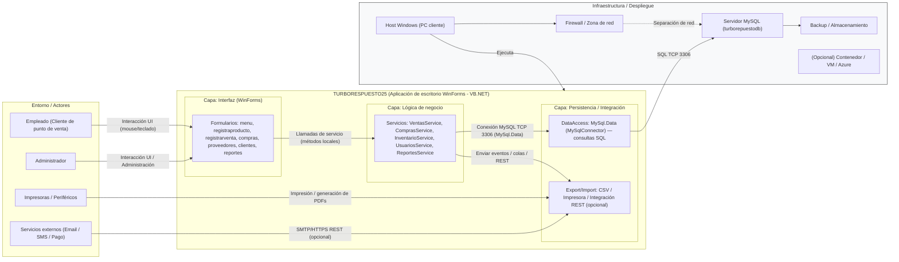

# Diagrama de Arquitectura - TURBORESPUESTO25

## Descripción del Sistema

Este diagrama muestra la arquitectura de TURBORESPUESTO25, una aplicación de escritorio desarrollada en VB.NET con WinForms que gestiona un sistema de punto de venta.

### Componentes Principales:

- **Capa UI**: Formularios de interfaz de usuario
- **Capa BL**: Servicios de lógica de negocio
- **Capa DAL**: Acceso a datos y integración con servicios externos
- **Infraestructura**: Servidor MySQL y componentes de despliegue
